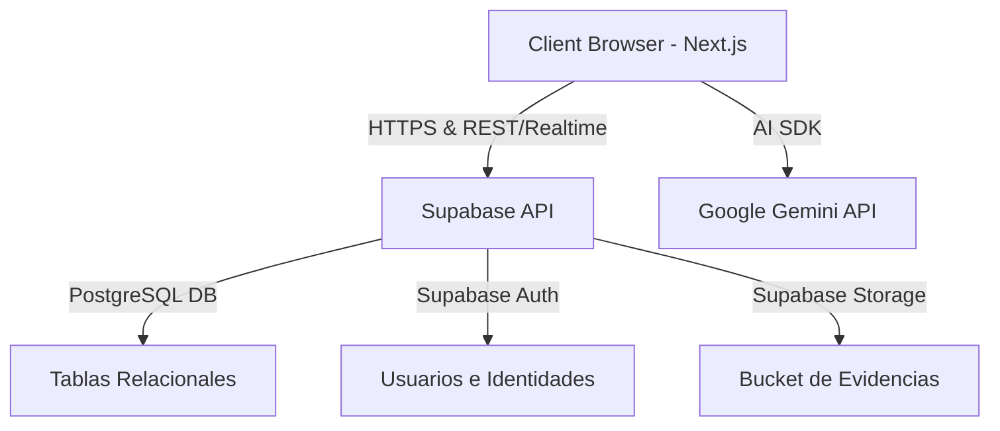

# Manual Técnico - EduControl.A.G.G

Este documento detalla la arquitectura técnica, el modelo de datos físico, los mecanismos de seguridad, automatizaciones (triggers) y la integración de Inteligencia Artificial del sistema **EduControl.A.G.G**.

---

## 🏗️ 1. Arquitectura de Software

La aplicación está construida sobre una arquitectura moderna basada en Next.js (App Router) y Supabase como Backend-as-a-Service (BaaS).



---

## 🗄️ 2. Modelo Físico de Base de Datos (PostgreSQL)

El sistema opera sobre las siguientes tablas principales definidas en `supabase/schema.sql`:

### Tabla: `public.users` (Mapeada a `auth.users`)
*   `id` UUID PRIMARY KEY REFERENCES `auth.users(id)` ON DELETE CASCADE
*   `email` TEXT NOT NULL
*   `first_name` TEXT
*   `last_name` TEXT
*   `role` app_role NOT NULL DEFAULT 'docente'
*   `estado` TEXT NOT NULL CHECK (estado IN ('Activo', 'Inactivo'))
*   `created_at` TIMESTAMPTZ DEFAULT NOW()

### Tabla: `public.alumnos`
*   `id` UUID PRIMARY KEY DEFAULT gen_random_uuid()
*   `nombres` TEXT NOT NULL
*   `apellidos` TEXT NOT NULL
*   `dni` TEXT UNIQUE NOT NULL CHECK (length(dni) = 8)
*   `codigo_estudiante` TEXT UNIQUE NOT NULL
*   `grado` TEXT NOT NULL
*   `seccion` TEXT NOT NULL
*   `nivel` TEXT NOT NULL CHECK (nivel IN ('Primaria', 'Secundaria'))
*   `estado` TEXT DEFAULT 'Activo' CHECK (estado IN ('Activo', 'Inactivo', 'Suspendido'))
*   `apoderado` TEXT NOT NULL
*   `telefono` TEXT NOT NULL
*   `fecha_nacimiento` DATE

### Tabla: `public.incidencias`
*   `id` UUID PRIMARY KEY DEFAULT gen_random_uuid()
*   `alumno_id` UUID REFERENCES `public.alumnos(id)` ON DELETE CASCADE
*   `alumno_nombre` TEXT NOT NULL
*   `alumno_grado` TEXT
*   `alumno_seccion` TEXT
*   `registrado_por` TEXT NOT NULL
*   `registrador_user_id` UUID REFERENCES `public.users(id)` ON DELETE SET NULL
*   `tipo` TEXT CHECK (tipo IN ('Inasistencia', 'Tardanza', 'Problema de comportamiento', 'Problema de salud', 'Conflicto entre alumnos', 'Observación académica'))
*   `severidad` TEXT CHECK (severidad IN ('bajo', 'medio', 'alto', 'leve', 'moderada', 'grave'))
*   `descripcion` TEXT NOT NULL
*   `evidence_urls` TEXT[] DEFAULT '{}'

### Tabla: `public.asistencias`
*   `id` UUID PRIMARY KEY
*   `alumno_id` UUID REFERENCES `public.alumnos(id)` ON DELETE CASCADE
*   `fecha` DATE NOT NULL DEFAULT CURRENT_DATE
*   `estado` TEXT CHECK (estado IN ('presente', 'falta', 'tardanza', 'justificado'))
*   `observacion` TEXT
*   *Restricción*: UNIQUE (alumno_id, fecha) para evitar duplicados en un mismo día.

---

## 🔒 3. Seguridad y Políticas a Nivel de Fila (RLS)

El acceso a la base de datos está endurecido mediante **Row Level Security (RLS)** en Supabase:

1.  **Políticas Generales**:
    *   Cualquier usuario autenticado puede leer datos de `alumnos`, `incidencias` y `asistencias`.
    *   Docentes y Auxiliares solo pueden insertar incidencias y asistencias.

---

## ⚙️ 4. Automatizaciones en Base de Datos (Triggers)

### Sincronización Automática de Perfiles (`public.users`)
Cuando un usuario se registra a través de Supabase Auth, se dispara el trigger `on_auth_user_created` que ejecuta la función:
```sql
CREATE OR REPLACE FUNCTION public.handle_new_user()
RETURNS TRIGGER AS $$
BEGIN
    INSERT INTO public.users (id, email, first_name, last_name, role, estado)
    VALUES (
        NEW.id,
        NEW.email,
        COALESCE(NEW.raw_user_meta_data->>'first_name', ''),
        COALESCE(NEW.raw_user_meta_data->>'last_name', ''),
        COALESCE((NEW.raw_user_meta_data->>'role')::app_role, 'docente'::app_role),
        'Activo'
    );
    RETURN NEW;
END;
$$ LANGUAGE plpgsql SECURITY DEFINER;
```

---

## 🧠 5. Integración de Inteligencia Artificial (Gemini)

Para mejorar y refinar las descripciones conductuales de las incidencias, el sistema utiliza **Google Genkit** y la API de **Google Gemini** a través de un flujo estructurado en `src/ai/flows/refine-incident-report.ts`.

El modelo analiza el texto borrador ingresado por el docente y devuelve un JSON optimizado estructurado de la siguiente forma:
*   `refinedText`: Texto formalizado en tercera persona, omitiendo sesgos y adjetivos subjetivos.
*   `detectedSeverity`: Clasificación sugerida (`leve`, `moderada`, `grave`).
*   `keyFactors`: Factores clave de la conducta detectados.
