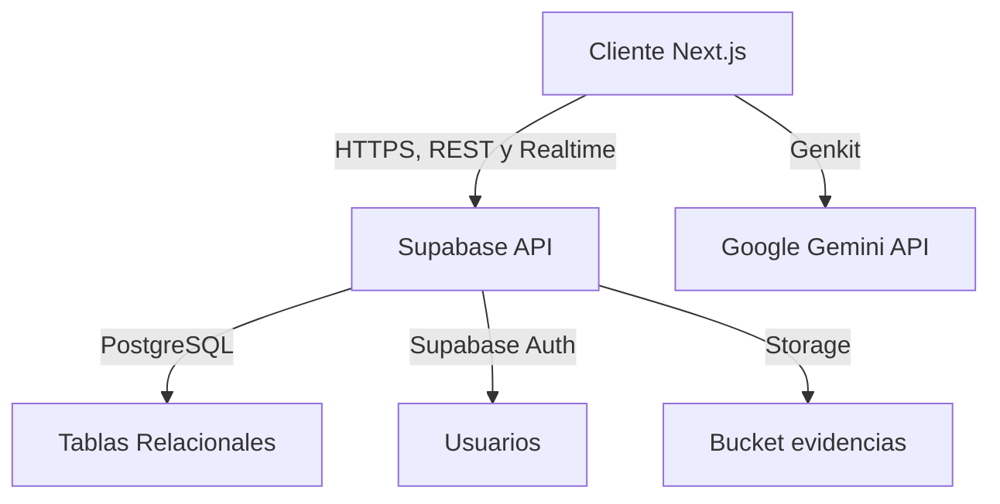

# Manual Tecnico - EduControl.A.G.G

Este documento resume la arquitectura tecnica, el modelo de datos, las politicas de seguridad y la integracion de IA del sistema.

---

## 1. Arquitectura

La aplicacion usa Next.js App Router en el frontend y Supabase como backend.

```mermaid
graph TD
    A[Cliente Next.js] -->|HTTPS, REST y Realtime| B[Supabase API]
    A -->|Genkit| C[Google Gemini API]
    B -->|PostgreSQL| D[Tablas Relacionales]
    B -->|Supabase Auth| E[Usuarios]
    B -->|Storage| F[Bucket evidencias]
```

---

## 2. Modelo de Base de Datos

Tablas principales definidas en `supabase/schema.sql`:

### `public.users`

* `id` UUID PRIMARY KEY REFERENCES `auth.users(id)`
* `email` TEXT NOT NULL
* `first_name` TEXT
* `last_name` TEXT
* `role` app_role NOT NULL DEFAULT `docente`
* `estado` TEXT NOT NULL
* `created_at` TIMESTAMPTZ
* `updated_at` TIMESTAMPTZ

Roles vigentes: `admin`, `director`, `subdirector`, `docente`, `auxiliar`.

### `public.alumnos`

* `id` BIGINT GENERATED BY DEFAULT AS IDENTITY PRIMARY KEY
* `nombres` TEXT NOT NULL
* `apellidos` TEXT NOT NULL
* `dni` TEXT UNIQUE NOT NULL
* `codigo_estudiante` TEXT UNIQUE NOT NULL
* `grado` TEXT NOT NULL
* `seccion` TEXT NOT NULL
* `nivel` TEXT NOT NULL
* `estado` TEXT NOT NULL
* `apoderado` TEXT NOT NULL
* `telefono` TEXT NOT NULL
* `fecha_nacimiento` DATE

### `public.incidencias`

* `id` UUID PRIMARY KEY
* `alumno_id` BIGINT REFERENCES `public.alumnos(id)`
* `alumno_nombre` TEXT NOT NULL
* `alumno_grado` TEXT
* `alumno_seccion` TEXT
* `registrado_por` TEXT NOT NULL
* `registrador_user_id` UUID REFERENCES `public.users(id)`
* `tipo` TEXT
* `severidad` TEXT
* `descripcion` TEXT NOT NULL
* `accion_tomada` TEXT
* `estado` TEXT
* `fecha` DATE
* `fecha_suceso` TIMESTAMPTZ
* `evidence_urls` TEXT[]

### `public.alertas`

* `id` UUID PRIMARY KEY
* `alumno_id` BIGINT REFERENCES `public.alumnos(id)`
* `alumno_nombre` TEXT NOT NULL
* `incidencia_id` UUID REFERENCES `public.incidencias(id)`
* `titulo` TEXT NOT NULL
* `mensaje` TEXT NOT NULL
* `nivel` TEXT
* `estado` TEXT
* `destinatario` TEXT
* `leido` BOOLEAN
* `accion_requerida` TEXT
* `fecha` TIMESTAMPTZ

### `public.evidencias`

* `id` UUID PRIMARY KEY
* `incidencia_id` UUID REFERENCES `public.incidencias(id)`
* `subido_por` UUID REFERENCES `public.users(id)`
* `nombre_archivo` TEXT
* `ruta_archivo` TEXT
* `tipo_archivo` TEXT

### `public.audit_logs`

* `id` UUID PRIMARY KEY
* `usuario` TEXT NOT NULL
* `usuario_id` UUID REFERENCES `public.users(id)`
* `modulo` TEXT NOT NULL
* `accion` TEXT NOT NULL
* `registro_id` TEXT
* `descripcion` TEXT NOT NULL
* `datos_anteriores` JSONB
* `datos_nuevos` JSONB

---

## 3. Seguridad RLS

Las politicas principales estan en `supabase/rls_policies.sql`.

* Administrador tiene control total.
* Director y subdirector tienen acceso institucional segun su responsabilidad.
* Docente registra incidencias y consulta sus registros o alumnos asignados.
* Auxiliar registra incidencias y gestiona alertas operativas.
* La insercion de evidencias requiere usuario autenticado.

---

## 4. Automatizaciones

El trigger `on_auth_user_created` crea el perfil en `public.users` cuando Supabase Auth registra un usuario nuevo.

El sistema genera alertas desde la aplicacion cuando:

* una incidencia se registra con severidad alta;
* un alumno acumula reincidencia dentro del periodo evaluado.

---

## 5. Inteligencia Artificial

Los flujos en `src/ai/flows` usan Genkit y Google Gemini para:

* refinar descripciones de incidencias;
* analizar imagenes de evidencia;
* generar resumenes de alertas y sugerencias de seguimiento.
